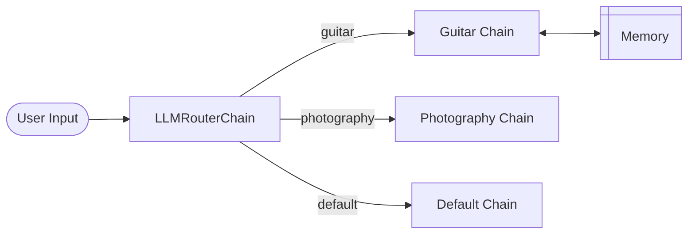

# langchain-multi-prompt-memory

A LangChain project that demonstrates multi-prompt routing with persistent conversation memory. The chatbot routes user questions to specialized expert agents (guitar instructor or photography expert) and retains buffer window memory across turns for the guitar domain.



- The **router** reads the user's input and decides which destination chain best fits the question
- The **guitar chain** uses `ConversationBufferWindowMemory` to remember the last `k` exchanges
- The **photography chain** is stateless — each question is answered independently
- The **default chain** handles anything that doesn't match a specialist


## Project Structure

```
.
├── .env                # API key (not committed)
├── .gitignore
├── DockerLangChain     # Container Creation
│   ├── .env            # API key (not committed)
│   ├── Dockerfile      # Docker File to create Docker image
│   ├── app
│   │   ├── __init__.py
│   │   └── main.py     # Includes FastAPI configuration with LangChain logic
│   └── requirements.txt
├── Project1.ipynb       # Standalone Jupyter notebook with all code
└── README.md
```

## Setup

### Prerequisites

- Python 3.9+
- OpenAI API key - Generate API key from here: https://platform.openai.com/settings/organization/api-keys

### Installation

```bash
pip install langchain openai dotenv
```


### Environment Variables

Create a `.env` file in the project root:

```
OPENAI_API_KEY=your_openai_api_key_here
```

## Usage

Open `Project1.ipynb`. The chain is invoked with:

```python
chain.run("your question here")
```


### Example Queries

```python
# Routed to guitar chain
chain.run("I can only play C, A, D, E chords. Give me 3 songs I can play.")
chain.run("What genre are these 3 songs from?")  # uses memory from previous turn

# Routed to photography chain
chain.run("What is shutter speed?")

# Routed to default chain
chain.run("What is the capital of France?")
```

## Key Implementation Details

The memory is instantiated outside the Router Chain, as the MultiPromptChain does not pass history through; it only routes the input string for each query independently. To accomplish this, we pass history as an input variable along with the input string for the guitar domain. The guitar_memory has the memory_key="history" and when we pass guitar_memory as an argument in LLMChain the guitar_memory is plugged into {history} of the guitar template.

To demo the ConversationBufferWindowMemory, the following prompts were used. These demonstrate how the LLMChain retains memory for the last 2 turns and doesn't retain memory from beyond the window.

### Configuration

| Parameter | Default | Description |
|---|---|---|
| `llm_model` | `gpt-4o-mini-2024-07-18` | OpenAI model to use |
| `k` | `2` | Number of past exchanges guitar chain remembers |

### Demo

<details>
<summary>See demo conversation</summary>

```python
# Turn 1 - remembers nothing yet
chain.run("I can only play C, A, D, E chords. Give me 3 songs I can play.")
# > "Sure! Here are three popular songs that primarily use the chords C, A, D, and E:..."

# Turn 2 - remembers Turn 1
chain.run("What genre are these 3 guitar songs?")
# > "The three songs mentioned span different genres:..."

# Turn 3 - remembers Turn 1 & 2
chain.run("Tell me one more guitar song.")
# > "Absolutely! Another song you can play with the chords C, A, D, and E is..."

# Turn 4 - window exceeded, forgets Turn 1
chain.run("What chords do I know?")
# > "I don't have access to your specific knowledge or the chords you know..."
```

</details>

# Containerization using Docker

## Setup

Visit this [link](https://www.docker.com/products/docker-desktop) to install the free version of Docker.

### Steps to Run


```bash
docker build -t langchain-app .
docker run -d --name langchain-app -p 80:80 --env-file .env langchain-app
docker ps
```

To stop and remove the image
```bash
docker stop langchain-app
docker rm langchain-app
```

Visit http://0.0.0.0:80/docs to interact with the application.


